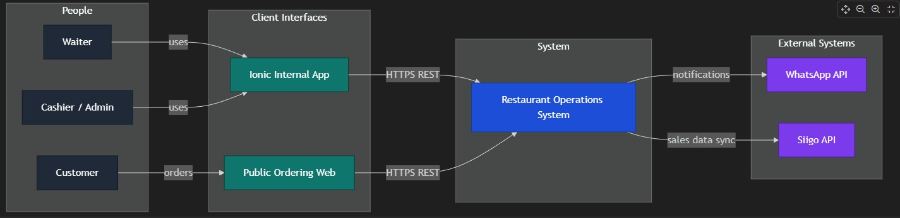
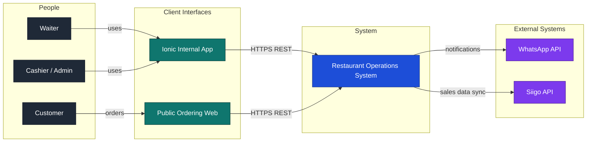

# C4 – Level 1 (Context Diagram)

## Purpose
Show the system as a whole and how it interacts with users and external systems.

## Mermaid Diagram (Context)

```mermaid
flowchart LR
  %% ====== Boundaries ======
  subgraph People["People"]
    W[Waiter]
    C[Cashier / Admin]
    U[Customer]
  end

  subgraph Interfaces["Client Interfaces"]
    IA[Ionic Internal App]
    PW[Public Ordering Web]
  end

  subgraph SystemBoundary["System"]
    S[Restaurant Operations System]
  end

  subgraph External["External Systems"]
    WA[WhatsApp API]
    SG[Siigo API]
  end

  %% ====== Relationships ======
  W -->|uses| IA
  C -->|uses| IA
  U -->|orders| PW

  IA -->|HTTPS REST| S
  PW -->|HTTPS REST| S

  S -->|notifications| WA
  S -->|sales data sync| SG

  %% ====== Styles ======
  classDef person fill:#1f2937,stroke:#111827,color:#ffffff;
  classDef client fill:#0f766e,stroke:#0b3d39,color:#ffffff;
  classDef system fill:#1d4ed8,stroke:#1e3a8a,color:#ffffff;
  classDef external fill:#7c3aed,stroke:#4c1d95,color:#ffffff;

  class W,C,U person;
  class IA,PW client;
  class S system;
  class WA,SG external;

```

