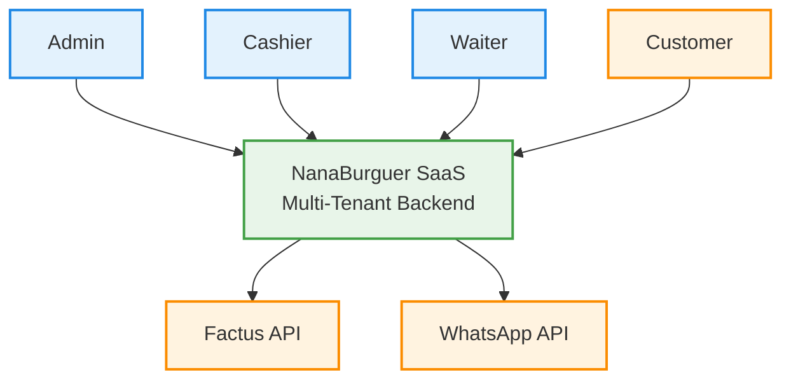

# 🍔 NanaBurguer Platform

## Vision, Scope, Actors & ADR (Multi-Tenant SaaS)

---

# 🧠 1. SYSTEM VISION

The NanaBurguer Platform is a cloud-native, multi-tenant SaaS system designed to digitalize and centralize restaurant operations.

The system is built from inception as a multi-tenant architecture, where each restaurant operates as an isolated tenant within a shared infrastructure.

This ensures:

- Scalability across multiple restaurants
- Strong data isolation
- Centralized infrastructure
- SaaS-ready evolution from day one

---

# 🎯 2. OBJECTIVES

- Replace manual and fragmented workflows
- Provide real-time operational visibility
- Enable structured order lifecycle management
- Integrate with fiscal systems (Factus)
- Allow scalable onboarding of new restaurants

---

# ⚠️ 3. PROBLEM STATEMENT

Restaurants commonly rely on:

- Paper-based processes
- WhatsApp coordination
- Disconnected tools

This produces:

- Order errors
- Lack of traceability
- Operational inefficiency
- No accounting integration

---

# 👥 4. ACTORS

## Internal Users (per tenant)

- Administrator / Owner
- Cashier
- Waiter

Each user belongs to exactly one restaurant.

---

## External Actors

- Customer (web / delivery)
- Factus API (electronic invoicing)
- WhatsApp API (notifications)
- Siigo API (future)

---

## Actor Interaction Diagram

---

# 🧩 5. SCOPE (MVP SaaS)

## Included

- Multi-tenant architecture
- Authentication + RBAC (tenant-aware)
- Menu management per restaurant
- Orders (dine-in, delivery, pickup)
- Order lifecycle management
- POS flow
- Optional electronic invoicing (Factus)
- WhatsApp notifications
- Audit fields (created_at, updated_at, restaurant_id)

---

## Excluded

- Multi-location per tenant
- Subscription billing system
- Inventory management
- Native mobile apps
- Advanced analytics

---
