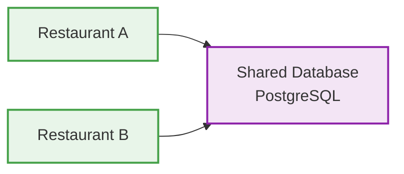

# ADR-001: Architectural Style Decision

# 🏗️ 6. ADR-001

## Status

Accepted

---

## Context

The system is designed as a production-ready SaaS platform.

It must:

- Be maintainable by a single developer
- Support multi-tenant architecture from the core
- Scale without major refactoring
- Be deployable in cloud environments

---

## Decision

Modular Monolith + Clean Architecture + Multi-Tenant Model

---

## Rationale

### Why NOT microservices?

- High operational complexity
- Infrastructure overhead
- Not suitable for MVP
- Difficult for solo development

---

### Why NOT layered monolith?

- Tight coupling
- Poor separation of concerns
- Hard to evolve into SaaS

---

### Why Modular Monolith?

- Clear separation of layers
- Domain independence from frameworks
- High testability
- Scalable architecture

---

## Multi-Tenant Strategy

---

## Approach

- Single database
- Logical isolation via `restaurant_id`
- Tenant-aware authentication (JWT)
- All entities scoped per tenant
- No cross-tenant data access

---

## Implications

- Every query MUST include tenant context
- Authentication includes restaurant_id
- Factus integration is per tenant
- Logs include tenant context

---

## Consequences

### Positive

- Scalable SaaS architecture
- Clean and maintainable codebase
- Easy onboarding of new restaurants
- Strong data isolation

---

### Negative

- Requires strict discipline in queries
- Slightly more complex than single-tenant systems

---

## Decision Owner

Project Author

---

# 📊 7. SUCCESS METRICS

- Stable cloud deployment
- Correct tenant isolation
- Complete order lifecycle without inconsistencies
- Successful integration with Factus
- SaaS-ready onboarding for new restaurants

---
