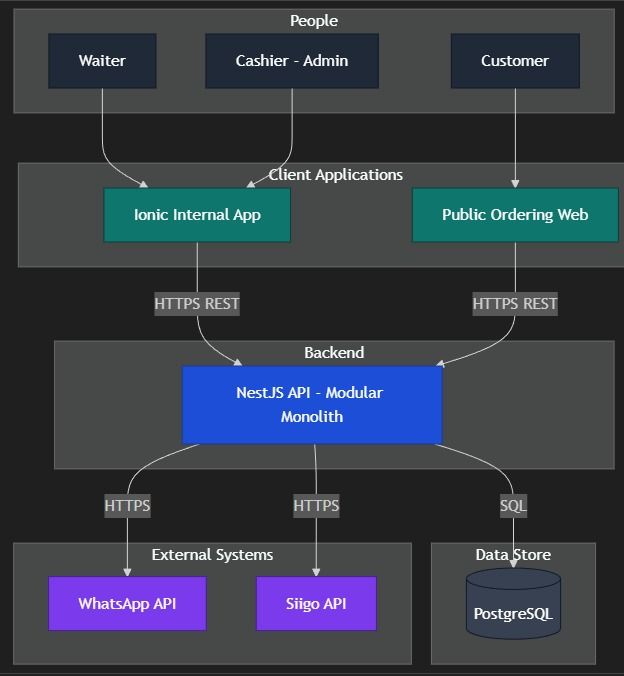
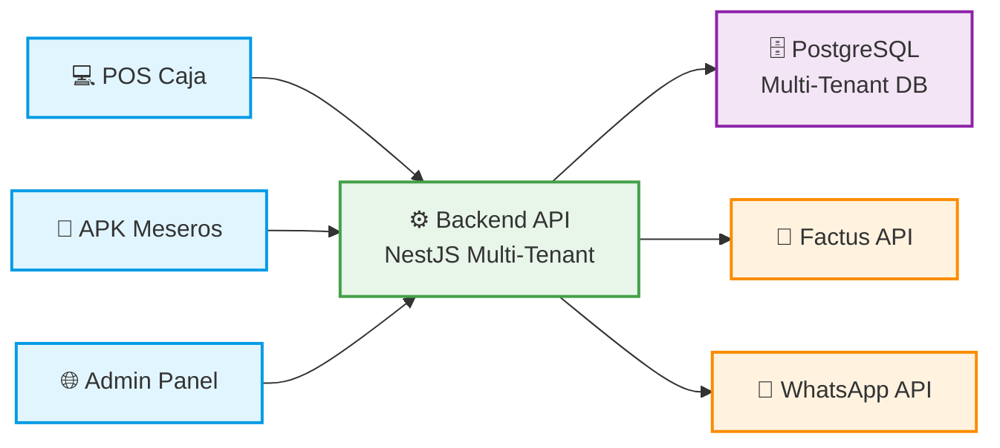

```mermaid
flowchart LR
    classDef frontend fill:#E1F5FE,stroke:#039BE5,stroke-width:2px
    classDef backend fill:#E8F5E9,stroke:#43A047,stroke-width:2px
    classDef db fill:#F3E5F5,stroke:#8E24AA,stroke-width:2px
    classDef external fill:#FFF3E0,stroke:#FB8C00,stroke-width:2px

    POS["💻 POS Caja"]:::frontend
    Mobile["📱 APK Meseros"]:::frontend
    Admin["🌐 Admin Panel"]:::frontend

    API["⚙️ Backend API\nNestJS Multi-Tenant"]:::backend

    DB["🗄 PostgreSQL\nMulti-Tenant DB"]:::db

    Factus["🧾 Factus API"]:::external
    WhatsApp["📲 WhatsApp API"]:::external

    POS --> API
    Mobile --> API
    Admin --> API

    API --> DB
    API --> Factus
    API --> WhatsApp

```
