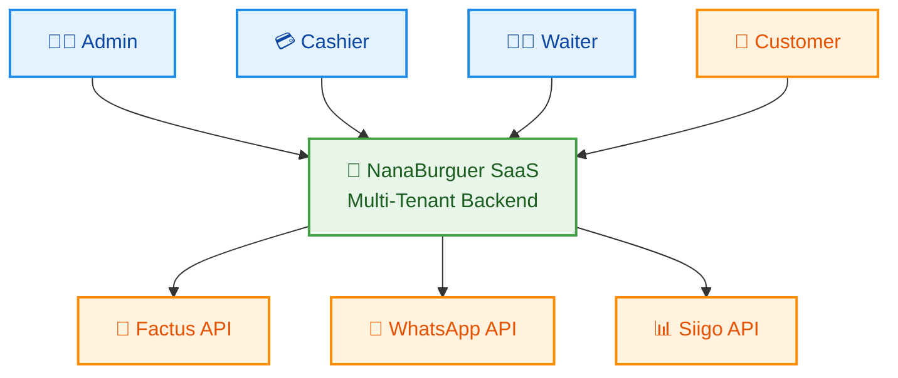

# C4 – Level 1 (Context Diagram)

# C4 Context Diagram

## NanaBurguer SaaS Platform

```mermaid
flowchart TB
    classDef tenant fill:#E3F2FD,stroke:#1E88E5,stroke-width:2px,color:#0D47A1
    classDef system fill:#E8F5E9,stroke:#43A047,stroke-width:2px,color:#1B5E20
    classDef external fill:#FFF3E0,stroke:#FB8C00,stroke-width:2px,color:#E65100

    Admin["👨‍💼 Admin"]:::tenant
    Cashier["💳 Cashier"]:::tenant
    Waiter["🧑‍🍳 Waiter"]:::tenant

    System["🍔 NanaBurguer SaaS\nMulti-Tenant Backend"]:::system

    Factus["🧾 Factus API"]:::external
    WhatsApp["📲 WhatsApp API"]:::external
    Siigo["📊 Siigo API"]:::external
    Customer["🧍 Customer"]:::external

    Admin --> System
    Cashier --> System
    Waiter --> System
    Customer --> System

    System --> Factus
    System --> WhatsApp
    System --> Siigo
```
