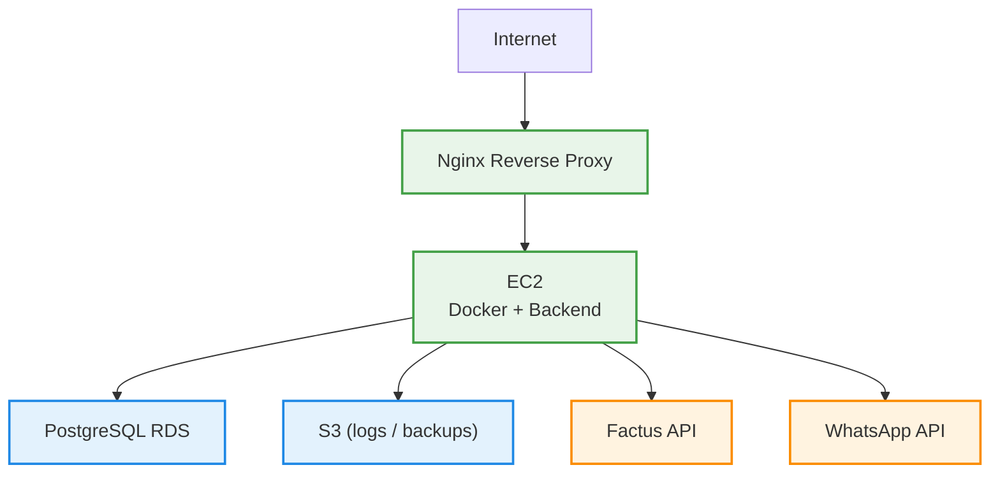

```markdown
# C4 – Level 2 (Container Diagram)
```


## Purpose

Show the major containers (applications/data stores) and how they communicate.

## Mermaid Diagram (Container)


```mermaid
flowchart TB
    classDef cloud fill:#E3F2FD,stroke:#1E88E5,stroke-width:2px
    classDef service fill:#E8F5E9,stroke:#43A047,stroke-width:2px
    classDef external fill:#FFF3E0,stroke:#FB8C00,stroke-width:2px

    Internet["Internet"]

    EC2["EC2\nDocker + Backend"]:::service
    Nginx["Nginx Reverse Proxy"]:::service

    RDS["PostgreSQL RDS"]:::cloud
    S3["S3 (logs / backups)"]:::cloud

    Factus["Factus API"]:::external
    WhatsApp["WhatsApp API"]:::external

    Internet --> Nginx
    Nginx --> EC2

    EC2 --> RDS
    EC2 --> S3

    EC2 --> Factus
    EC2 --> WhatsApp
```

---
