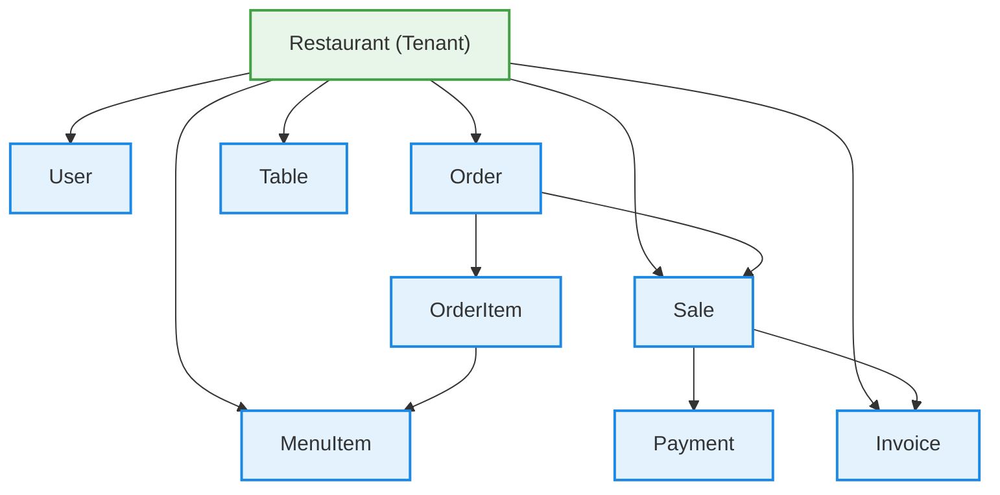

# Domain Model (Multi-Tenant SaaS)

## Purpose

Define the core business concepts for a multi-tenant restaurant SaaS platform.

---

# 🧠 CORE CONCEPT

The system is multi-tenant.

👉 Every aggregate belongs to a:

- Restaurant (Tenant)

---

# 🏢 0) Restaurant Aggregate (ROOT OF EVERYTHING)

Represents a business using the platform.

**Key responsibilities**

- Configuration
- Factus credentials
- Ownership of all data

---

# 🧾 1) Order Aggregate (Root: Order)

Handles operational flow (NOT money).

**Entities inside**

- Order
- OrderItem
- OrderStatusHistory

---

## Status Flow (IMPORTANT)

CREATED  
→ SENT_TO_KITCHEN  
→ IN_PREPARATION  
→ READY  
→ DELIVERED  
→ CLOSED

---

## Invariants

- Orders must have at least one item
- Status transitions are controlled
- CLOSED orders are immutable
- DINE_IN requires table
- DELIVERY requires address + phone

---

# 💳 2) Sale Aggregate (NEW - CRITICAL)

Represents financial transaction.

**Why separate from Order?**

👉 Because:

- Not all orders are invoiced
- POS ≠ Invoice
- Accounting requires separation

---

## Entities

- Sale
- Payment

---

## Invariants

- One Sale per Order
- Payment must match total
- Sale is immutable once closed

---

# 🧾 3) Invoice Aggregate (Factus)

Represents electronic invoicing.

---

## Entities

- Invoice

---

## States

- PENDING
- ACCEPTED
- REJECTED

---

## Invariants

- Not all Sales generate Invoice
- Invoice depends on customer request

---

# 🍔 4) Menu Aggregate

- Category
- MenuItem

---

# 🪑 5) Table Aggregate

- Table

---

# 👤 6) User Aggregate

- User
- Role

---

# 🔥 RELATIONSHIPS (CORRECTED)

---

# 🧠 CLAVE FINAL

👉 Order = operación  
👉 Sale = dinero  
👉 Invoice = DIAN

👉 Restaurant = TODO

---
