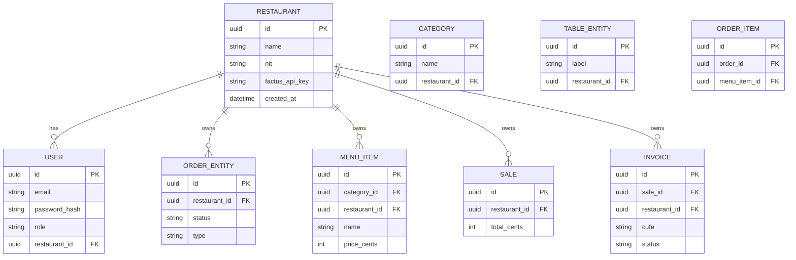

# ER Diagram - SaaS Multi-Tenant (Refactored)

```mermaid
erDiagram

    RESTAURANT {
        uuid id PK
        string name
        string nit
        string factus_api_key
        datetime created_at
    }

    USER {
        uuid id PK
        string email
        string password_hash
        string role
        uuid restaurant_id FK
    }

    CATEGORY {
        uuid id PK
        string name
        uuid restaurant_id FK
    }

    MENU_ITEM {
        uuid id PK
        uuid category_id FK
        uuid restaurant_id FK
        string name
        int price_cents
    }

    TABLE_ENTITY {
        uuid id PK
        string label
        uuid restaurant_id FK
    }

    ORDER_ENTITY {
        uuid id PK
        uuid restaurant_id FK
        string status
        string type
    }

    ORDER_ITEM {
        uuid id PK
        uuid order_id FK
        uuid menu_item_id FK
    }

    SALE {
        uuid id PK
        uuid restaurant_id FK
        int total_cents
    }

    INVOICE {
        uuid id PK
        uuid sale_id FK
        uuid restaurant_id FK
        string cufe
        string status
    }

    RESTAURANT ||--o{ USER : has
    RESTAURANT ||--o{ ORDER_ENTITY : owns
    RESTAURANT ||--o{ MENU_ITEM : owns
    RESTAURANT ||--o{ SALE : owns
    RESTAURANT ||--o{ INVOICE : owns
```
