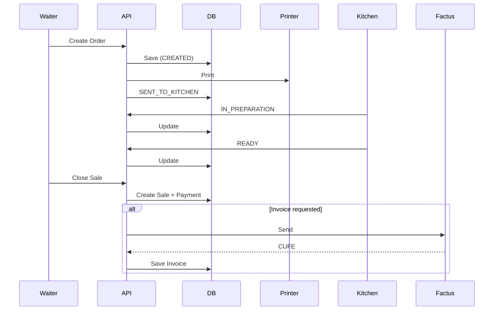

# Runtime View (End-to-End Flows - Multi-Tenant SaaS)

## Purpose

Describe the runtime behavior of the system including:

- Multi-tenant context
- Kitchen flow (printer + KDS)
- POS vs Invoice separation
- External integrations (Factus, WhatsApp)

---

# 🧠 GLOBAL RULE

All requests are tenant-aware:

- Every request includes `restaurant_id`
- All queries are scoped by tenant
- No cross-tenant access is allowed

---

# 🔄 Flow 1: Public Web Order (Delivery / Pickup)

## Steps

1. Customer browses menu (Public Web).
2. Customer submits order.
3. Frontend calls `POST /orders`.
4. API:
   - validates input
   - resolves `restaurant_id`
   - calculates totals
5. API persists Order with status `CREATED`.
6. API emits `OrderCreated`.
7. API sends command to kitchen printer.
8. API updates status → `SENT_TO_KITCHEN`.
9. API triggers WhatsApp (non-blocking).
10. API returns response.

---

## Key Notes

- WhatsApp is best-effort (never blocks).
- Kitchen printing is part of core flow.
- All operations are tenant-scoped.

---

# 🍽 Flow 2: Internal Order (Waiter App)

## Steps

1. Waiter logs in → JWT includes `restaurant_id`.
2. Waiter creates order.
3. API validates:
   - RBAC
   - tenant ownership
4. API saves Order (`CREATED`).
5. API sends to kitchen (printer).
6. API updates → `SENT_TO_KITCHEN`.
7. API returns success.

---

# 👨‍🍳 Flow 3: Kitchen Flow (KDS)

## Steps

1. Kitchen sees incoming orders (KDS or printed).
2. Kitchen starts preparation:
   - API → `IN_PREPARATION`
3. Kitchen finishes:
   - API → `READY`

---

## Status Lifecycle (UPDATED)

CREATED  
→ SENT_TO_KITCHEN  
→ IN_PREPARATION  
→ READY  
→ DELIVERED  
→ CLOSED

---

# 💳 Flow 4: Close Sale (POS)

## Steps

1. Cashier closes order.
2. API validates:
   - Order is READY or DELIVERED
3. API creates **Sale entity**.
4. API creates **Payment**.
5. API marks Order → `CLOSED`.

---

## Key Notes

- Order ≠ Sale
- Sale is financial record

---

# 🧾 Flow 5: Electronic Invoice (Factus)

## Steps

1. Customer requests invoice.
2. API loads tenant Factus config.
3. API sends invoice to Factus.
4. Factus responds:

### Success

- CUFE generated
- status = ACCEPTED

### Failure

- status = PENDING
- retry mechanism triggered

---

## Key Notes

- Invoice is optional
- POS does NOT require Factus

---

# 🔁 Flow 6: Retry Mechanism (Factus)

## Steps

1. Background job scans pending invoices.
2. Retries sending to Factus.
3. Updates status accordingly.

---

# 📡 Flow 7: Real-Time Updates

## Steps

1. Kitchen updates status.
2. API persists change.
3. API emits WebSocket event.
4. Waiter app receives update instantly.

---

# 🔐 Security & Observability

- JWT includes tenant context
- Every request logs:
  - requestId
  - restaurant_id
  - userId
  - action
  - result

---

# 📊 Runtime Diagram

---
