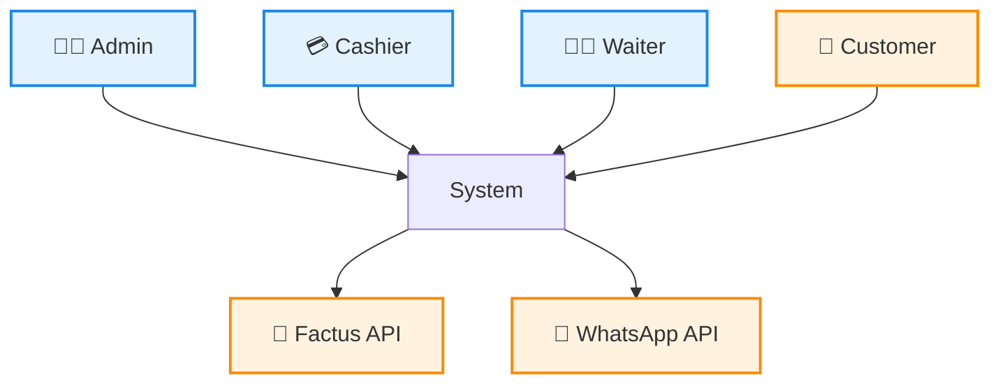

# Vision & Scope Document

## Multi-Tenant Restaurant Operations SaaS

---

## 🧠 System Vision

The NanaBurguer Platform is a cloud-native, multi-tenant SaaS system designed to digitalize and centralize restaurant operations.

The system is built from inception as a scalable SaaS platform, where each restaurant operates as an isolated tenant.

---

## 🎯 Objectives

- Replace manual and fragmented workflows
- Provide real-time operational visibility
- Enable scalable multi-restaurant management
- Integrate with fiscal and notification services

---

## ⚠️ Problem Statement

Restaurants commonly rely on:

- Paper-based workflows
- WhatsApp coordination
- Disconnected tools

This results in:

- Order errors
- Lack of traceability
- Inefficient operations
- No accounting integration

---

## 👥 Actors

